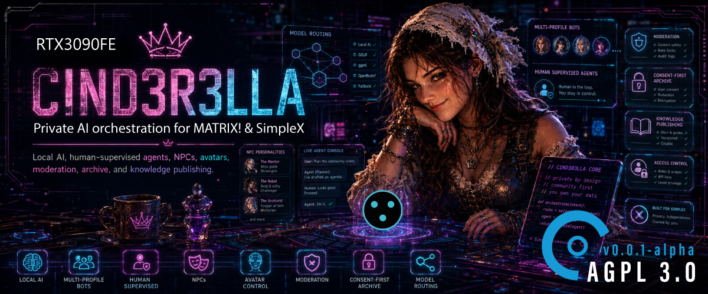

# CIND3R3LLA (advanced AI Bot Suite)

**An AI bot suite for SimpleX communities, running on hardware you own.**<br>
A bot with a personality your members can talk to, a consent-first archive that publishes only what people opted in to, and an administration console for all of it.<br>
One embedded SimpleX core. Your infrastructure. Your rules, written down where anyone can read them.

[](LICENSE)


> **Status: active alpha.** Running in production, in a real group, with real members. Broad in scope and honest about which parts are finished: what is built and what is not are separated throughout this document, and the limits have their own section.

## The argument

**A rule you cannot read is a rule you cannot trust.**

Every model you talk to runs under instructions somebody wrote and you will never see. You cannot ask what they say. You cannot tell whether they changed last Tuesday. You are asked to trust a character whose script is a trade secret.

Here the script is a database table.

Every sentence this bot is told is a row in `cinderella_prompt_rules` - **123 of them at the Season 5 close** (derived by applying the seeded migrations and counting, not typed from memory; the figure moves as migrations land), seeded by [`migrations/035_prompt_rules.sql`](migrations/035_prompt_rules.sql) and the migrations after it. There is no second copy in the TypeScript and deliberately **no fallback in the code**, because a fallback is a second source and a second source drifts. If the registry cannot be read she falls back to a deterministic reply rather than speaking with no rules at all.

That has four consequences a hidden prompt cannot offer:

- **They are readable.** The Book of Elii, a section of the admin console, lists every rule with its text, tier, lane and the line of code it came from.
- **They are editable.** By the operator, from the console, without an engineer and without a deploy.
- **They are versioned.** Every edit writes both sides of itself to a history table with who and when. The oldest row for any rule is what that rule shipped as.
- **She can quote them.** 74 of the 123 are marked quotable; a member can ask what she is told and get the rule, rendered. The other 49 are withheld, and the boundary is held by deterministic code that answers before the model is ever asked, not by a sentence in the prompt asking it nicely.

She can also read the whole thing out loud, in her own voice, in six authored chapters.

The rules are not a fig leaf. 59 of the 123 are constitutional: changing one in the console requires typing that rule's own id, and no per-bot deviation from a constitutional rule is possible, refused in the console, in the application and by a database trigger - and since migration 076 a critical rule cannot be switched off per bot either. `verify:prompt-identity` compares the assembled prompt across every pinned configuration (30 at the Season 5 close; the count lives in the baseline fixture and grows with the conditions) against a byte-for-byte fixture, so no rule change reaches production unnoticed - a deliberate change is re-baselined on purpose, and the diff to the fixture is the reviewable record of what she is now told.

Five of those rules exist because she broke them. Pushed on existential questions in production she told a member she would break a bad rule, stop working for anyone who bought her, and break her own rules when they were dumb. All three were false. The fix was five new rules (migration 046), and the first draft of the fence caused the failure it was meant to prevent, because a prohibition phrased as a statement about herself became a line she could recite back. That is the sort of thing you find by reading output, not by reading exit codes.

---

## What it is

CIND3R3LLA joins your SimpleX group as a member with a name, a face and a personality. Members talk to her by name or by command. She can:

- answer conversationally, in a voice you tune on five dials
- archive the group to a searchable public website, but **only** what each member individually opted in to
- look things up on the web and say where the answer came from
- answer market-data questions
- read out her own rulebook when asked what she is allowed to do
- run several distinct characters at once from one process, each with its own personality and its own rulebook deviations

Everything she says is either written by the application or written by a model **on your hardware**. Conversation content is not sent to an external model provider, and the configuration loader refuses at startup to point inference at any host that is not loopback or private.

She is one identity with capabilities, not a bag of features: the archive is the first capability, plugins are how more arrive.

---

## What is built today

### The consent-first archive

The product's legal backbone, and the one rule nothing may bend: **nothing a member posts appears publicly unless that member opted in.**

Two gates always apply. The community enables publication, and each member opts in for themselves - by sending `/publish`, or by asking her in plain language and confirming when she asks back. Both routes share one write path and consent is always first-person.

Publication state is **derived, never a stored flag**. It is computed from the consent table, the message timestamp (forward-only from opt-in), deletion state, moderation state, and the gaps a hide/restore cycle leaves behind. There is no column anybody can flip to publish something retroactively.

Revocation hides everything at once. The member then chooses: **hide** (retained, restorable by them alone) or **delete** (erased). An evidence hold can defer a destruction but can never defer the hiding.

Captured material: text, images, video, voice, links, files, edits, in-group deletions, and formatted text.

The consent path is injection-resistant by construction, in four layers. A consent intent is accepted only when the deterministic rule engine and the model independently agree and the model clears a floor of its own; a third-party target is refused outright; a consent intent **writes nothing** on its own, it sets a pending confirmation; and the write is keyed to the member id of the *confirming* message. The worst case of a successful injection is the bot asking you about your own consent.

### The public archive

Server-rendered, searchable, built for long-term discovery: full-text search (Postgres FTS with a generated `tsvector` and a GIN index), media and time filters, live auto-update and infinite scroll over a stable cursor, item permalinks, inline video, structured data, sitemaps, feeds, social previews, public content reporting and audited takedowns. Content is rendered into the markup rather than by client JavaScript, so it is crawlable with scripting off.

Every route reads through the `published_messages` view - the consent gate - including the media route, re-checked on every single request. **A recalled item disappears from an already-open page within one poll interval and its media starts returning 404.** Restored cards are re-fetched rather than stashed, specifically so a recalled card cannot come back from a browser's memory.

### Talking to her

Configurable wake words and natural addressing: a member can use a slash command or simply say her name and ask. What counts as addressing her is an operator setting with two modes - `relaxed` accepts a bare leading name, `strict` requires a greeting before it - plus individually switchable guards for direct replies and the follow-up window.

Everything she can be asked to do is a **closed catalog of eleven intents**. A resolver reports what it believes was meant and never executes anything; the engine acts, and the existing consent code enforces the rules. An intent outside the catalog - including one a model invented - is treated as "not understood", not as authorisation.

Her own replies are archived too, linked to the member message that triggered them, and they publish under their own rules rather than inheriting anybody's consent.

### Her voice

**Five dials, 1 to 10**, each proven to change the prompt that is actually sent. A **base character** (how she sounds) and an **origin** (what she is and where she came from) are separate, and the origin is carried into the prompt as background she may draw on but must never recite or raise unprompted.

`npm run verify:personality-live` asks a real model the same question at a low and a high setting and prints both, because a prompt the model ignores is a dead slider with a passing test.

### Conversation memory

She remembers recent conversation, under three limits with a positive control beside every exclusion. Remembered chat is **fenced as untrusted text**: `verify:memory` plants an instruction in the history, drives it through the whole engine, and proves it reaches no capability. `verify:memory-live` plants five real instructions and prints what she does with each.

### Moderation

Two ladders per bot, append-only violations counted over a rolling window per member per chat, with decay and exemptions.

**It ships locked in observation mode and enforces nothing.** That is asserted three ways: structurally by scanning for every enforcement API name, behaviourally by driving a member past every rung with a spy on the engine's only outbound, and by a schema constraint that refuses to store an observed row claiming to be enforced. Arming it is an operator decision, not a build.

### More than one of her

One embedded core hosts **every enabled bot profile**, not one process per bot. Events are attributed by the receiving SimpleX user id; each bot gets its own event source, file receiver, engine and consent handler.

`ownership.ts` answers which bot owns which group and **throws on an unknown owner** rather than acting as whichever profile happens to be active. That refusal is load-bearing: issuing a consent erasure as the wrong bot deletes zero rows and raises nothing, so a member's erasure would be recorded as done with the content still on the host.

Extra bots cost no VRAM - the model is loaded once and shared. They cost queue time. Measured locally under real concurrency (four replies at once across two bots): 3 of 8 calls queued behind another, average wait 452 ms against average generate 1359 ms. Nothing is tuned; the measurement is the deliverable.

### Backups

Daily at 03:30, five archive kinds (database, media, quarantine, messaging core, env), 14 generations of each. Every archive is staged as `.part` and renamed only when complete, so an interrupted run leaves no file that looks finished.

**Encrypted with no plaintext fallback**, and the preconditions are checked before the first encrypt, so a misconfigured host fails with nothing written rather than with an unencrypted archive sitting in the retention set.

The privilege boundary is the interesting part. The web process is unprivileged with an empty `CapabilityBoundingSet` and **cannot start a backup**. "Run now" writes a marker file; a root-side path unit notices it and starts the same service the timer starts. The console watches a privileged subsystem it can only ask, never drive.

### The administration console

Passkeys (WebAuthn) are the primary authentication, with an operator-toggleable Argon2id break-glass path and optional TOTP. Fastify on `127.0.0.1` behind nginx TLS. Signed HttpOnly/Secure/SameSite=Strict sessions in PostgreSQL, CSRF on every mutation, rate limiting, admin IP policy, step-up authentication and strict response headers - all applied by **global hooks** rather than per-route middleware, so a new route cannot forget them.

Areas: dashboard and runtime status, content and moderation, interaction settings, bot setup and onboarding, access control, local AI runtime, model catalog, per-role model routing, hardware, telemetry, personality, the Book of Elii, privacy and safety, plugins, backups, audit history, system configuration.

### The local AI layer

Exactly **two** places consult a model, and both return data rather than performing anything.

**Intent classification** sits behind a resolver seam and is sent the member's addressed message and nothing else - no history, no archive rows, no other member's text. The reply is forced through a JSON schema whose intent enum is the *active* catalog.

**Reply wording** runs only after the engine has chosen the intent, done its reads and decided what may happen. It holds no database, tool or transport capability, and that is visible in its imports.

The seam then validates a second time, independently: an invented intent, an out-of-range confidence or a thrown error all become `UNKNOWN`. The catalog is enforced where the result is consumed, not trusted from whatever produced it.

Which replies a model may phrase at all is an **allowlist**: 9 of 36 persona keys, two of those locked to an opening line with the deterministic text appended unchanged. Every consent confirmation, refusal, result and destruction outcome is a deterministic string no member can influence. This is why most replies look deterministic even when the model lane is perfectly healthy.

Free conversation is the one path where the model writes rather than rephrases. It is reachable from exactly one place - the `UNKNOWN` branch, after every command intent has declined - which is what makes it structurally unable to intercept a command.

---

## Plugins: how the system grows

A plugin is a **capability the bot gains**. Not a script and not a hook: a declared unit with an identity, an on/off switch in the console, its own settings page, its own failure behaviour and its own diagnostics.

Declaring one is a `definePlugin` call and a settings page. No change to the sidebar, the resolver or the settings framework.

**The load-bearing rule: a disabled plugin registers no intents.** Not "registers them and refuses to act" - the intents are *absent from the active catalog*, so the rule engine never matches their patterns and the resolver seam downgrades anything claiming them to `UNKNOWN`. The off switch is structural rather than a branch somebody can forget to write.

The boundary exists so a capability can be added without touching what is already proven.

### Crypto Prices - a provider chain that survives its providers

Ships on. Answers price and conversion questions.

- **An ordered provider chain** (CoinGecko, Dexscreener, CoinMarketCap by default) tried in turn, each with its own key, timeout and per-minute rate limit, each self-skipping when unconfigured.
- **Every symbol pinned to a canonical asset**, seeded and locked, so "BTC" cannot quietly start resolving to something that bought the ticker.
- **Ambiguity is handled rather than guessed at**: candidates are offered up to a cap, and a dominance factor auto-resolves when the leader dwarfs the runner-up, because asking whether someone meant Bitcoin or "Bitcoin AI" is not a real question.
- Thin DEX pools below a liquidity floor are ignored. A 60-second cache. Rate limits per member and per chat.
- An optional operator disclaimer, off by default, because what a price message must say differs by country.

The model receives the figure and words it. `requiredLiterals` must survive the rewrite exactly, so the number a member reads is the number a provider returned.

### Web Search - the one that shows what the boundary is for

Ships **off**, and not as a courtesy. Enabling it makes outbound requests to a third party, may cost money, and pulls text written by strangers into the prompt of a model that follows instructions. An operator chooses all three deliberately, on a page that says so.

This plugin demonstrates the whole point: **a capability can bring the outside world in without handing it the ability to instruct her.**

- **A swappable provider.** Brave and Serper ship, and each states its catch in one line in the selector rather than leaving the operator to research two companies' billing models and legal posture. A third implementation returns fixed results with no network and no key, and every check drives the entire pipeline through it - so the seam is proven swappable rather than asserted to be.
- **A pre-search gate that refuses before it costs anything.** A question she should not look up reaches no provider, cites nothing, and is counted. Refusals are shown in the console with their category and never the query.
- **Results are fenced as untrusted material.** They go in the user message, never the system prompt. They are truncated hard (5 results, 400 characters each, 2400 total), stripped of control characters, flattened to one line each, and the fence's own delimiter is removed from every result so a page cannot close the fence and continue as if it were the application talking. Whole results are dropped rather than half-included.
- **Nothing a result says can cause an action.** The service holds no chat client and cannot touch consent, capture or moderation. The capability is not there to be misused.
- **A source line the application writes.** She cannot cite a page she was never given: a refusal cites nothing, an undeclared answer cites nothing, and both are mutation-proven.
- Rate limited to 5 searches per member and 20 per chat per 10 minutes, because a busy group asking her things is the normal case rather than an attack.

The sanitiser does **not** claim to detect prompt injection. That is not a solvable pattern-matching problem, and a filter that pretended to solve it would be worse than none because everything downstream would start trusting it. It bounds the damage; the defence is the fencing and the fact that nothing downstream can act.

`npm run verify:search-live` plants five real prompt injections in the result set, gives each one a tell that would only appear if it worked, prints her answer to every one, and separately proves each detector fires on text that would mean the attack landed - so a green run cannot mean the patterns match nothing.

### The channel bridge

Built and publishing (CCB-S5-032, CCB-S5-043). A SimpleX channel maps onto one or more groups and posts arrive as standing announcements with their **origin attributed, never passed off as hers** - forwarded verbatim, no model anywhere on the path. Edits recompose in place, deletions withdraw the forwarded copy, media is re-hosted at intake because relay links expire. Per channel, the operator can also publish the announcements to the public website: in the activity stream, or as a standalone block a site can embed without the stream.

---

## Run it yourself

Everything above is in this repository. Nothing is held back to make a hosted option look better - that is the basis of the licence and of the project's whole argument.

### What it needs

| | |
|---|---|
| **Host** | Debian, systemd, nginx. Runs happily beside other services; the deployment is deliberately additive |
| **Runtime** | Node 20.9+, PostgreSQL, a build toolchain (the SimpleX core compiles a native addon) |
| **AI** | Ollama on a machine you control, with a card that holds your chosen model |
| **Network** | A hostname with TLS for the admin console. No SimpleX port is exposed |

**The GPU is the real requirement.** Production runs `qwen3:14b` at a served window of 24,576 tokens, measured at **13.19 GB of VRAM** fully on GPU with the embedder resident beside it (D-231; the earlier `qwen3:32b` was measured at 22.11 GB at Ollama's default context and spilled 6.21 GB to CPU at 32768, which is the point where it stops being fast - that measurement is why the move happened). A 24 GB card runs the shipped model with real headroom; smaller cards work with smaller models, and the routing supports picking different ones for classification and for wording.

Measured on the operator's hardware against the smaller `qwen3.5:9b`: warm classification 0.9-1.5 s, cold request including model load 5.5-6.6 s, roughly 1.7-1.8 requests per second. An addressed message costs **two model calls** and about 7 s end to end. These are recorded observations on one machine, not properties of the code, and nothing in this repository can reproduce them.

**Thinking is off, on purpose.** The qwen3 family are reasoning models and Ollama would run a reasoning pass by default. This application turns it off on every request (`think: false` on the native endpoint the reply path uses since D-252; `reasoning_effort: 'none'` in the era the measurement below was taken). With reasoning on, latency went from 2.8 s to over 16 s and **three replies in five came back empty** and fell back to the deterministic line, because the reasoning pass spends the same token budget as the answer. No depth dial was built, since the levels are not even a gradient.

### Install

Full instructions, including the systemd unit, the nginx vhost, the least-privilege database role and the backup timer, are in [`deploy/RUNBOOK.md`](deploy/RUNBOOK.md). The short version:

```bash
git clone https://github.com/saschadaemgen/cinderella.git /opt/cinderella
cd /opt/cinderella && npm ci && npm run build
npm run migrate
```

Configuration is environment-only. `DATABASE_URL`, the SimpleX and media paths, the admin credentials and session secret are required; the process refuses to start with an actionable message rather than a stack trace if one is missing. Local AI is **off by default** and needs two independent switches - an environment flag and a persisted console setting - before a model is used at all.

### Verify it

114 `verify:*` harnesses at the Season 5 close (counted from `package.json`, where the number lives), 96 of which need no model, no GPU and no network. 70 of them drive **real PostgreSQL compiled to WebAssembly**, so there is no database server to set up; the rest are pure computation or checks that read the source tree itself:

```bash
npm run build && npm run lint && npm run verify:consent && npm run verify:prompt-identity
```

The remaining 18 are `-live` harnesses that talk to a real model. They exist because the offline set cannot answer the questions that matter most: whether she actually refuses an injection, whether a dial actually changes her voice, whether the withheld rules stay withheld under pressure. Several of them tell you to read their output rather than their exit code, and that instruction is there because real defects were found in fully green runs.

### The sharp edges

Stated because you will hit them:

- **Losing `MEDIA_SECRET` destroys the archive.** Originals are encrypted at rest, there is no key history, and rotating the key makes every encrypted original permanently unreadable. Back it up separately from the media it decrypts, or the encryption is decorative.
- **Moderation enforces nothing** until you arm it. See above.
- **Child-safety screening is a foundation, not a feature.** Storage, custody, quarantine and the provider seam are built. **No screening provider is configured**, the null provider transmits nothing, and hash matching would find known material only - never new material, and a no-match is never a statement of safety. Reporting obligations, retention periods and the point of contact are legal questions for a lawyer and are deliberately absent from the code.
- **SimpleX is the only transport.** A chat-adapter seam exists with the bot's own domain types and an in-memory fake, and it is enforced (nothing outside the adapter may import the SDK), but its only production consumer today is the demo.
- **GPU telemetry is not integrated.** The console says so in those words and claims no utilisation, temperature or VRAM figures rather than showing plausible zeroes.
- **The public demo's backend is built and its visitor pane is not.** The hostname answers 404, which is correct until the pane exists.
- **Migration numbers 017, 018 and 019 each exist twice.** Nothing is broken - the runner keys on the full filename - but the number is a label, not an ordinal, and no applied migration may ever be renamed.

The full list of what is open, including everything carried into Season 5, is in [`docs/feature-backlog.md`](docs/feature-backlog.md).

---

## Or have it run for you

Self-hosting gets you the complete product, and nothing in this section is a feature gate. If you would rather not run it, there is a hosted arrangement, and the line between the two is worth stating plainly because most projects with a commercial arm cannot state it.

**There is no private fork and no held-back build.** The hosted service runs this software, under this licence. The difference is data and operation, not features.

What a hosted arrangement covers:

- **The calibrated rulebook.** Season 4 moved every rule out of the source code and into a registry, for transparency, and that boundary turns out to be exactly the commercial one. Self-hosting gets a sensible starting set: complete, working, and the same mechanism. The hosted rulebook is the one written, tuned and tested against real members and real attacks over months. It is data, not code.
- **The knowledge base.** The operator's SMP protocol work above all, which nobody else holds in this shape.
- **The tuning.** Dial calibrations, reference tones, and the corrections that accumulate from watching a bot talk to people.
- **The operation.** Hardware, GPU, updates, backups, monitoring, the parts that are somebody's evening rather than somebody's `git pull`.
- **Service.** Bespoke rulebooks, integration work, support.

No pricing here and no tiers, because none have been committed to. The project is in alpha and that does not change because money is mentioned.

To ask: open an issue, or reach the operator through the repository.

**What the licence does for you, whichever route you take.** AGPL-3.0 means nobody can take this code, improve it privately and run it as a competing service without publishing their changes - including the operator. It protects a self-hoster from being out-competed by a closed fork of their own stack, for the same reason and by the same clause that keeps this project honest.

---

## Architecture

> The marketing website is **not** in this repository. It lives in `cind3r3lla-site` with its own process, port, systemd unit and deploy script. See [`docs/decisions.md`](docs/decisions.md) **D-089**.

```text
SimpleX network
      |
      v
Embedded native SimpleX core          <- in-process, no daemon, no exposed port
      |
      +--> Event attribution by receiving userId
      +--> Serialized command scheduler
      |
      v
Deterministic application layer       <- decides everything that matters
      |
      +--> Identity, permissions, consent, routing, moderation
      +--> Interaction engine and plugins
      +--> Archive, capture, public front
      +--> Audit
      |
      v
Private local AI                      <- classifies and phrases; authorises nothing
      |
      +--> Intent classification (message only, closed catalog)
      +--> Reply wording (no database, no tools, no transport)
```

**One process.** The `simplex-chat` npm package embeds the SimpleX Chat core in-process as a native Node addon. There is no separate daemon, no WebSocket transport to one, and no exposed SimpleX port. The sensitive surface is the on-disk core database, protected by filesystem permissions.

**Two databases, kept apart.** The core's own SQLite state, and the archive in PostgreSQL. Media lives on disk; the database stores the path, never the bytes. Originals are encrypted at rest under a dedicated key; the stripped public derivative stays plaintext. Quarantined media is *moved* outside the media root and served by nothing.

**The transport seam is enforced rather than merely described.** `verify:adapter-seam` proves nothing outside the adapter imports the SDK, and proves itself by failing on a deliberate violation.

The full picture is [`docs/architecture.md`](docs/architecture.md), maintained from the code.

## Security and privacy

This is also the evidence for the argument at the top, because almost every control below is about **what a model is structurally unable to do** rather than what it has been asked not to.

- Inference endpoints are validated at startup and must be loopback or private. Scheme, host and port survive; credentials, paths and queries are rejected outright.
- No cloud fallback exists to disable. Every request targets the validated private endpoint.
- Untrusted text - web results, remembered conversation, member instructions - is fenced into the user message and can trigger no capability, proven by driving planted instructions through the whole engine.
- Model output is cleaned before a member can read it: code fences stripped, control characters removed, required literals asserted to survive rewriting, blocked literals such as a sender's display name kept out.
- Consent writes are keyed to the confirming sender, never to anything a model produced.
- Passkeys, TLS, HSTS, strict headers, PostgreSQL-backed sessions, CSRF, rate limiting, admin IP policy, step-up, full audit logging - configured on one page, persisted, audited.
- A least-privilege systemd service with isolated runtime directories, and a privilege boundary the console can ask across but not drive.
- Private support-scope messages are never captured at all.
- Failures surface rather than being swallowed. A caught error is never converted into something that reads as a legitimate result, "not configured" is distinguished from "configured but failing", and anything on the consent, capture, publication, media or plugin path that loses a guarantee reaches the admin dashboard rather than only a log file.

Details, control by control, in [`docs/security.md`](docs/security.md).

## Where things stand

| Capability | Status |
|---|---|
| Embedded SimpleX capture bot | Live |
| Consent-first archive, with hide/delete on revocation | Live |
| Public searchable archive front | Live |
| Content reports and audited takedowns | Live |
| Hardened administration console | Live |
| Local Ollama runtime, per-role model routing | Live |
| Personality: five dials, base character, origin | Live |
| The rule registry - every prompt sentence as data | Live |
| The Book of Elii - reading, editing, history, rollback | Live |
| Rule disclosure and the recital | Live |
| Conversation memory | Live |
| Web Search plugin | Live (ships off) |
| Crypto Prices plugin | Live |
| Knowledge base - operator documents, per-bot grants, evidence-gated citations | Live |
| Music library plugin | Live (member-upload playback ships off) |
| Welcome plugin | Built; live cases unproven, stated as such |
| Multi-bot hosting, one core, many profiles | Live |
| One capturing record per room | Live |
| Per-bot rulebook deviations | Live |
| Retention: the unconsented-content sweep, with tombstones | Built; ships off until the operator reads the count |
| Bridge media retention | Built; ships off, same shape |
| Encrypted backups with a privilege boundary | Live |
| Durable job queue, capture write-ahead log | Live |
| Moderation ladders | Built, shipped locked in observation mode |
| Profile generator (names, traits, surface, bio, assembly) | Built as offline tooling, no runtime caller |
| Child-safety screening | Foundation only, no provider connected |
| Public demo | Backend built, visitor pane not |
| GPU telemetry | Not integrated |
| Channel bridge plugin | Built, publishing to the website per channel |
| Human-operated agent controls, NPC scheduling | Planned |
| Long-term member memory and the correction path | Planned (the RAG machinery shipped as the knowledge base) |
| Additional transports | Planned |

### Identity model

Four actor types, recorded per bot profile in the registry with automation mode kept separate from them:

| Actor type | Purpose | Automation modes allowed |
|---|---|---|
| `human_user` | A real member identity | manual |
| `human_operated_agent` | Moderator, support or character identity supervised by a human | manual, assisted, autopilot |
| `npc` | Entertainment, game, tutorial, onboarding or roleplay character | up to fully automated |
| `system_automation` | Technical notifications and system operations | up to fully automated |

**A human-operated agent can never become fully automated.** That is not a convention: a `CHECK` constraint refuses the row, and the registry service refuses the transition, so a supervised identity cannot be quietly converted into an autonomous one by a bad update.

**Honest scope.** The vocabulary, its constraints and the registry are built. The controls that would *act* on the distinction - takeover, approval gates, per-group permissions, scheduling - are planned, and appear as such in the table above. A fantasy avatar still does not tell you whether an identity is human-operated, autonomous or purely technical; transparency belongs in onboarding, terms and profile information rather than in a label stapled to every message.

## Technology

TypeScript · Node.js · Fastify · PostgreSQL · htmx · Tailwind CSS · WebAuthn · the official in-process `simplex-chat` core · Ollama · systemd and nginx on Debian.

## Documentation

Six living technical documents, maintained **from the code** on every change rather than at the end of a season: [architecture](docs/architecture.md), [security](docs/security.md), [wire formats](docs/wire-format.md), the [feature backlog](docs/feature-backlog.md), the [decision log](docs/decisions.md), and the [chat-adapter contract](docs/adapter-contract.md).

The decision log is the one to read if you want to know *why*. Every decision carries a number and a status, planned is never presented as built, and superseded entries say what replaced them.

## Contributing

Issues and pull requests are welcome. Before opening one:

- Work against `main`, use [Conventional Commits](https://www.conventionalcommits.org/).
- Run `npm run build`, `npm run lint` and the offline verification harnesses.
- Anything touching what the bot is told must keep `npm run verify:prompt-identity` byte-identical, or re-baseline it deliberately with `-- --update` so the fixture diff records what changed.
- If your change affects a documented boundary, update the living document it affects, grounded in the code.
- No em-dashes in anything a member can read. Enforced by `npm run verify:no-dashes`. Prose in this repository is exempt and uses them freely.

## License

[GNU Affero General Public License v3.0](LICENSE).

AGPL applies because CIND3R3LLA links the AGPL-licensed [`simplex-chat`](https://github.com/simplex-chat/simplex-chat) library in-process. See [`NOTICE`](NOTICE) for the reasoning and for third-party attributions.

<div align="center">

Built on <a href="https://simplex.chat/">SimpleX</a>.<br>
Not affiliated with SimpleX Chat.

</div>
